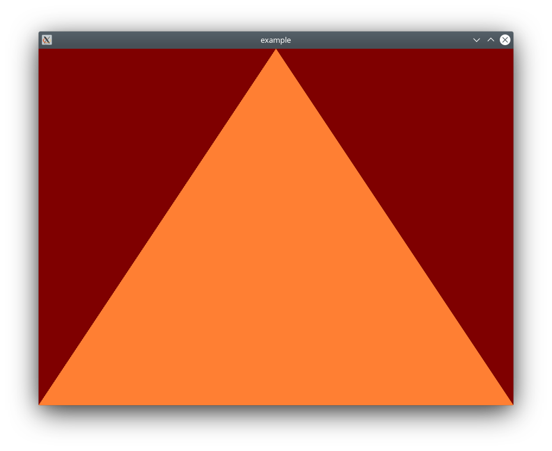

# glpp

This is a thin wrapper library for modern OpenGL in C++. All of its functions and classes can be used in conjunction with native
OpenGL calls.

# Dependencies

* OpenGl
* GLEW
* GLFW3

# Installing

```bash
cd <glpp project dir>
mkdir build
cd build
cmake ..
make install
```

# Building
In you install the library a glppConfig.txt is created. The easiest way to link  against glpp is using cmake. You can use ```find_package(glpp)``` to find the library. It will export two targets. ```glpp::core``` which contains the OpenGl wrappers and ```glpp::system``` which contains a wrapper for window creation.

```cmake
find_package(glpp REQUIRED)
target_link_libraries(your_target PRIVATE glpp::core glpp::system)
```

# Error Handling

Native OpenGl lacks support for proper error handling. Faulty calls into the API result in silent failover or program termination.
In order enable proper error handling in debug mode ```glpp::call()``` is introduced. This method takes a handle to a API call and
the necessary arguments. If DEBUG mode is enabled ```glpp::call()``` will throw an exception containing an error description.

```c++
#include <glpp/glpp.hpp>

int main() {
//set up context
  glpp::call(glBindTexture,42,1337); // This will throw a std::runtime_error with the message:
  // "GL_INVALID_OPERATION: The specified operation is not allowed in the current state.
  // The offending command is ignored and has no other side effect than to set the error flag."
  return 0;
}
```
The precondition for ```glpp::call()``` is, that there are no OpenGl errors present on the error stack. I recommend to wrap all calls into the
OpenGl API with this wrapper to prevent any unnoticed errors.

# Higher level abstractions

## System

The system module is not included in the glpp::core library and contains the window class. This class removes all the boilerplate code
to create a window with a OpenGl context. If you need a more fine grained controll over the context creation, i recommend to fall back
to GLFW or whatever library you want. You dont need to link against the system module in this case.

```c++
#include <glpp/system/window.hpp>

int main(int argc,	char **argv) {
	glpp::system::window_t window(800, 600, "example", glpp::system::window_t::vsync_t::off);
	window.enter_main_loop([&]() {
  	glpp::call(glClear, GL_COLOR_BUFFER_BIT | GL_DEPTH_BUFFER_BIT);
    // Whatever you want to render
  });
  return 0;
}
```

## Buffer
The ```glpp::object::buffer_t``` is a wrapper for OpenGl buffers. The class constructor allocates video memory and copys transfers the data. The initialisation of a static buffer for vertex data is shown in the example.
```c++
std::array<glm::vec3, 3> data;
buffer_t<glm::vec3> buffer(
	buffer_target_t::array_buffer,
	data.data(), data.size(),
	buffer_usage_t::static_draw
);
buffer.bind();
// Use the buffer
```
## Vertex Array Object
To be able to use buffers for rendering vertex array objects should be used. The OpenGl vao's are wrapped by ```glpp::object::vertex_array_t```. Because buffer_t has a template parameter, that encodes the data layout of the buffer, the vao can deduce the parameters for stride, elements per vertex and type in trivial cases. This can also
be overwritten if the buffer data shall be used in a different way.

```c++
std::array<glm::vec3, 3> data;
buffer_t<glm::vec3> buffer(
	buffer_target_t::array_buffer,
	data.data(), data.size(),
	buffer_usage_t::static_draw
);
vertex_array_t vao;
vao.attach(buffer, 0);
vao.bind();
// Call glDrawArrays or other render function
```

## Shader

This library comes with a wrapper for shader objects and shader programs. The shader objects ```glpp::object:shader_t``` takes a shader type and source code on construction and deals with the allocation and compilation of the shader and its code. The ```glpp::object:shader_program_t``` takes ```shader_t``` and linkes them together. The used shader objects can be deleted after linking. The shader programm can be used to set uniforms of shaders. The ```set_uniform()``` method is strongly typed and takes trivial types and vectors or matrices from the glm library as arguments.

```c++

shader_program_t get_shader_program() {
	shader_t vertex(
		shader_type_t::vertex,
		"#version 330 core\n\
		layout (location = 0) in vec3 aPos;\n\
		\n\
		void main()\n\
		{\n\
			gl_Position = vec4(aPos.x, aPos.y, aPos.z, 1.0);\n\
		}"
	);

	shader_t fragment(
		glpp::object::shader_type_t::fragment,
		"#version 330 core\n\
		uniform vec4 color;\n\
		out vec4 FragColor;\n\
		\n\
		void main()\n\
		{\n\
			FragColor = color;\n\
		}"
	);
	return shader_program_t(vertex, fragment);
	// vertex and fragment shader objects are freed after the linking.
}

int main() {
//[...]
	auto shader = get_shader_program();
	shader.set_uniform("color", glm::vec4(1.0, 0.0, 0.0, 1.0));
//[...]
}
```

## Model, View and Renderer

To render primitives there glpp implements an additional layer of abstraction. The ```glpp::render::renderer_t``` can render ```glpp::render::view_t```. The ```view_t``` encapsulates the buffer and vertex array objects and can be crated from ```glpp::render::model_t```. The implemented ```model_t``` does only provide a method to add verticies to the buffer. To get a more useful model class for you application you can simply inherit from the modal and add new features.

Both ```model_t``` and and ```view_t``` have a template argument ```vertex_description_t```. This argument is a POD struct, that is a representation of the datalayout in the buffer. The different attributes can be activated in the view by passing pointer-to-member of the attributes to the constructor of the view. The order of these arguments has to match the order in the vertex shader in order to bind them to the correct attributes.


```C++
#include <glpp/object/shader.hpp>
#include <glpp/render/renderer.hpp>
#include <glpp/render/model.hpp>
#include <glpp/render/view.hpp>
#include <glpp/system/window.hpp>

#include <glm/glm.hpp>

struct uniform_description_t {
	glm::vec4 color;
};

struct vertex_shader_t : public glpp::object::shader_t {
	vertex_shader_t() :
		glpp::object::shader_t(
			glpp::object::shader_type_t::vertex,
			"#version 330 core\n\
			//the vertex shader takes a vec3 for attribute location 0 \
			layout (location = 0) in vec3 aPos;\n\
			\n\
			void main()\n\
			{\n\
				gl_Position = vec4(aPos.x, aPos.y, aPos.z, 1.0);\n\
			}"
		)
	{}
};

struct fragment_shader_t : public glpp::object::shader_t {
	fragment_shader_t() :
		glpp::object::shader_t(
			glpp::object::shader_type_t::fragment,
			"#version 330 core\n\
			uniform vec4 color;\n\
			out vec4 FragColor;\n\
			\n\
			void main()\n\
			{\n\
				FragColor = color;\n\
			}"
		)
	{}
};

struct vertex_description_t {
   // the vertex description has to have at least one vec3,
   // because of the attributes in the vertex shader
	glm::vec3 position;
};

class model_t : public glpp::render::model_t<vertex_description_t> {
public:
	// We inherit from model_t to add our simple add_triangle helper method
	void add_triangle(
		const glm::vec3& first,
		const glm::vec3& second,
		const glm::vec3& third
	) {
		m_verticies.reserve(m_verticies.size()+3);
		m_verticies.emplace_back(vertex_description_t{first});
		m_verticies.emplace_back(vertex_description_t{second});
		m_verticies.emplace_back(vertex_description_t{third});
	}
};


int main(
	int argc,
	char **argv
) {

	glpp::system::window_t window(800, 600, "example", glpp::system::window_t::vsync_t::off);
	glpp::render::renderer_t<uniform_description_t> renderer{
		vertex_shader_t(),
		fragment_shader_t()
	};

	// before we can set a uniform for the first time, we have to register its name
	renderer.set_uniform_name( &uniform_description_t::color, "color" );
	renderer.set_uniform( &uniform_description_t::color, glm::vec4(1.0f, 0.5f, 0.2f, 1.0f));

	// Create a model
	model_t model;
	// Add our geometry
	model.add_triangle(
		glm::vec3{-1.0, -1.0, 0.0},
		glm::vec3{1.0, -1.0, 0.0},
		glm::vec3{0.0, 1.0, 0.0}
	);

	// Initilise the view using our custom model
	glpp::render::view_t<vertex_description_t> view(
		model,
		// use the glm::vec3 for the attribute on location 0,
		// which is "layout (location = 0) in vec3 aPos;"
		&vertex_description_t::position
	);

	glpp::call(glClearColor, 0.5,0.0,0.0,1.0);
	window.enter_main_loop([&]() {
		glpp::call(glClear, GL_COLOR_BUFFER_BIT | GL_DEPTH_BUFFER_BIT);
		// use the renderer to render our view
		renderer.render(view);
	});

	return 0;
}
```




