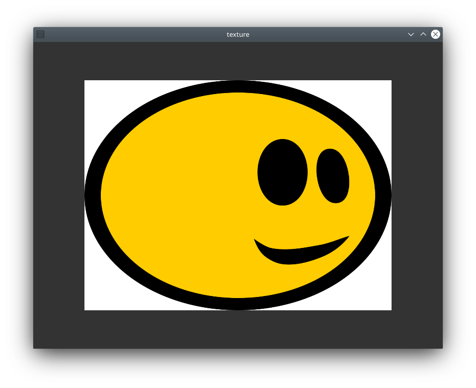
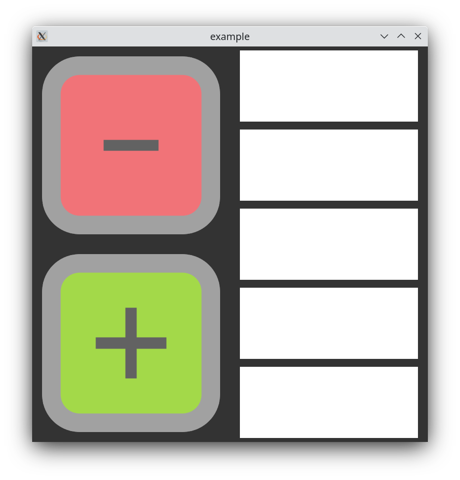
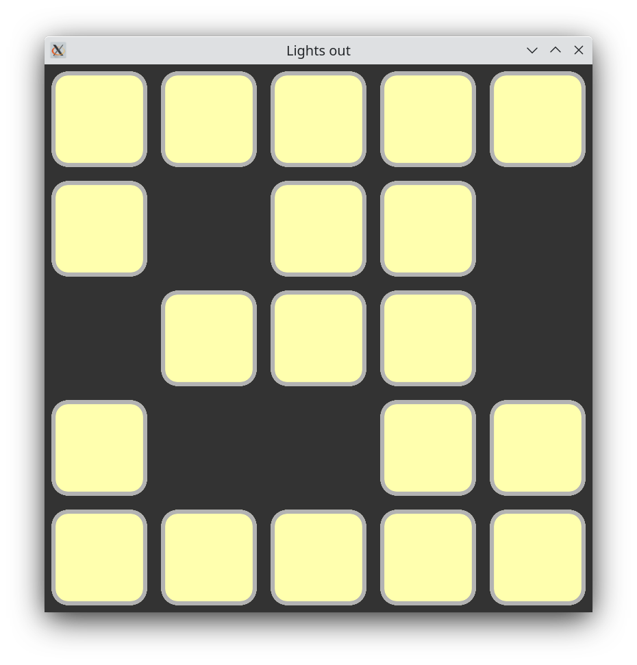

<p align="center">
  
</p>


This is a thin wrapper library for modern OpenGL (4.5) in C++. The main goal of this library is giving you a painless experience building your own OpenGL application and seamlessly integrate into the existing C++/STL ecosystem. It follows a fail fast principle meaning many of the pitfalls of the OpenGL API are either made impossible for you by added restrictions due to the strong typed nature of Glpp or help you identify problems via throwing exceptions.

Glpp is no replacement for the OpenGL API nor does it saves you from learning the API or catch all possible ways of abusing the OpenGL API. It is a productivity framework to get you going faster and help you spend your time on building your application rather than handling all of the state on your own and loading textures, assets or type faces into your application.


For a quick dive into the library you can check out the examples below or read the [documentation](https://fabian-jung.github.io/glpp).

[](example/01.first_triangle)  | [](example/02.input)   | [](example/03.texture)
:---:|:---:|:---:
[](example/04.breakout) | [](example/05.cube) | [](example/06.framebuffer)
[](example/07.text) | [](example/08.text_box) | [](example/09.ascii_race)
[](example/10.ui) | [](example/11.lights_out) | [](example/12.asset_loading)

# FAQ

- What platforms are supported?
    - Currently only Linux is regularly build and tested for. Specifically Ubuntu 20.04 and Arch Linux. Building on Windows should be possible, but is untested. Mac is currently not supported, because there is no OpenGL 4.5 support in MacOS.
- Where can I find help?
    - You can check out the [documentation](https://fabian-jung.github.io/glpp), [examples](https://github.com/fabian-jung/glpp/tree/master/example) or get into contact via the [forum](https://github.com/fabian-jung/glpp/discussions).
- I found a bug, how can I get it fixed?
    - You can create a issue in the main project or create a fix yourself and create a PR. If you are unsure you can start a discussion [here](https://github.com/fabian-jung/glpp/discussions).
- Where can I request a new feature?
    - Same as with a bug report. You can create a issue or start a discussion in the forum.
- How stable is the API?
    - Glpp is still work in progress. The API might change at any point in time. The Glpp::gl, Glpp::core, Glpp::image and Glpp::system modules are somewhat mature enough to expect some level API stability.
- How stable is the library?
    - I try to make Glpp as bug free as possible. There is an extensive test suite, that runs tests on a unit test level as well as render tests with special scenes. Tests are run on each PR and regularly on master. However the userbase is still small, so bugs are to be expected.
- I'd like to use Glpp, but MIT license is not allowing to. What can I do?
    - Please reach out. We probably will find a solution.

# Dependencies

Glpp does use C++20 features both internally as well as in its interface. Therefore you need a C++20 compliant compiler both for building glpp as well as your application. GCC 11 and Clang 12 are used in the CI Pipelines. Other than that the following dependencies are used in one way or another: 

* libfmt
* Boost (headers-only)
* Catch2
* GLEW
* GLFW3
* Assimp
* STBimage
* Freetype

Glpp is build in a modular way, so you don't have to include all modules and dependencies into your project. To get an overview over the project structure have a look at the following dependency graph of the library:


# Building

Building Glpp from source should be an easy process. Clone the repository to your local machine and enter the directory you cloned the sources into. Create a directory for your build and enter that directory too. After that you can run ```cmake ..``` to configure the build. After that you can build the whole library, tests and examples by running ```make```.

```bash
git clone https://github.com/fabian-jung/glpp.git
cd glpp
mkdir build
cd build
cmake ..
make

# If you want to execute the tests run this:
make test
```

If you do not want to build all modules, tests or examples, you can change the build in the configure stage by overwriting the following values:
- enable_asset
- enable_examples
- enable_image
- enable_system
- enable_text
- enable_ui
- enable_unit_test

They can take the values "ON" and OFF" and are enabled by default. To overwrite them, either edit your build configuration with ```ccmake``` or add ```-D<paramet>==<value>``` e.g. ```-Denable_asset=OFF``` to the ```cmake`` call.

The external dependencies are resolved by cmake and should be found automatically, if they are present on your system. If cmake has trouble finding them, or you want to inject a specific version of a dependency into the build you can do so by overwriting the ```<dependency>_DIR``` cmake cache variable.

# Installing

After Glpp is successfully build, it can be installed via the ```install``` target. If you want to change the location of the installation you can do so by overwriting the cmake cache variable ```CMAKE_INSTALL_PREFIX``` with the desired location.

```bash
# after building
sudo make install
```

## Arch linux
If you want to install Glpp on an Arch Linux System, you can do so by using the makepkg file in the ```glpp/scripts``` directory. Just enter that directory and run ```makepkg```. After the package is build it can be installed via ```sudo pacman -U glpp-<version>-x86_64.pkg.tar.zst```.

There is also a weekly prebuild package. You can find it under this [action](https://github.com/fabian-jung/glpp/actions/workflows/build_package.yml). Select the latest successful run of the pipeline and download the package from the artifacts section.


# Linking

Once glpp is build and installed you can link you are ready to link against it. If it is installed under the default path, cmakes ```find_package``` command should be able to find it by itself. If not you have to provide the ```glpp_DIR``` with the ```CMAKE_INSTALL_PREFIX``` of your installation.

The usage of glpp looks like this:

```cmake
find_package(glpp REQUIRED)
target_link_libraries(your_target PRIVATE glpp::core glpp::system)
```

The following targets are exported by the glpp package:
- glpp::gl
- glpp::core
- glpp::image
- glpp::system
- glpp::test
- glpp::text
- glpp::ui

## How can I link against Glpp without using cmake

All needed header files and shared objects are in your ```CMAKE_INSTALL_PREFIX```. As long as you instruct your compiler to inspect the needed include directories and link against the needed shared object files you should be good to go. Just keep in mind, that you also have to take care of all the dependencies that are used by glpp.